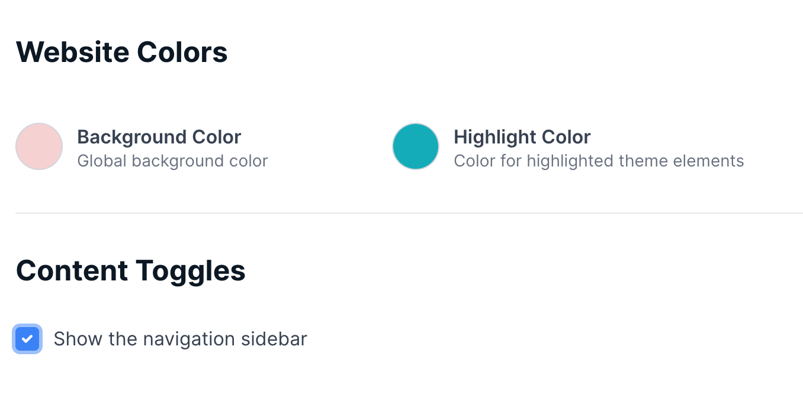

# Transistor Themes Reference

Transistor themes provide a <a href="https://shopify.github.io/liquid/" class="text-blue-500 hover:text-blue-700 font-medium">Liquid</a> template based theming system for Transistor websites. A customer can enable a website for their show, and can select one of various themes to configure in their preferred way.</p>

## Getting Started

Theme development is done with our local theme development server, receiver. Once configured receiver will retrieve data from a Transistor show and render the contents of the theme you're building.

### Installing

Create a project folder for your theme, and download the appropriate binary for your operating system:

Mac (Intel)
```
curl https://transistorfm.s3.amazonaws.com/receiver/receiver-apple-intel -o receiver
chmod +x receiver
```
Mac (ARM)
```
curl https://transistorfm.s3.amazonaws.com/receiver/receiver-arm64 -o receiver
chmod +x receiver
```
Windows
```
curl https://transistorfm.s3.amazonaws.com/receiver/receiver-windows.exe -o receiver.exe
chmod +x receiver
```

### Running

A simple way to get started is with a basic theme skeleton generated by receiver. `./receiver new` will generate all the files necessary in a theme folder in the current directory. Once generated, you can run the development server:
```
./receiver server --api_key your_api_key --subdomain your_show_subdomain
```
And visit http://localhost:8080/

**Api Key**

Receiver uses your API key to authenticate to Transistor. Your API key can be viewed and reset in the <a href="https://dashboard.transistor.fm/account">Account Area</a> of your Transistor Dashboard.

**Subdomain**

In the website settings for your show you can chose a subdomain, this tells receiver what show it will be rendering.

**Port**

The port the receiver server runs on by default is 8080. Add a `--port 1234` to change to another port if desired.

<hr>

## Liquid

Liquid is an open-source template language created by Shopify. It uses <a href="#objects">objects</a>, <a href="#tags">tags</a>, and <a href="#filters">filters</a> to display dynamic content. Have a look at the <a href="https://shopify.github.io/liquid/">Liquid documentation</a> to get a feel for how it works.

```
<div class="episode">
  <h1>{{ episode.title }}</h1>
  
  <span>
    <time>{{ episode.published | date: '%B %d, %Y' }}</time>
    &bull;
    {{ episode.duration | divided_by: 60 | round }} minutes
  </span>
  <p class="episode-summary">{{ episode.content.notes }}</p>
</div>
```

### Includes

Liquid provides a mechanism for including a template within another template. Includes will have access to the objects provided to the top level template, but you can pass variables to them in a variety of ways:

Simply include another template:
```

```

Include a template with a local variable:
```

```

Include a template for a collection:
```

```

### Transistor Components

Transistor provides some some components to use for common needs, and are used via the same <a href="#includes">include</a> mechanism above.

#### components/player
```

```
The player component provides a functional and styleable audio player for an episode.

#### components/social_links
```

```
The social_links component displays a list of social media links (along with email and donate links if configured). The `links` parameter is an optional list to narrow down links you'd like to display, if ommitted only configured services will show.

#### components/subscribe_links
```

```
The subscribe_links component displays a list of players where listeners can subscribe to the show. The `links` parameter is an optional list to narrow down links you'd like to display, if ommitted only configured players will show.

#### components/newsletter
```

```
The newsletter component allows users to signup for the show's newsletter, using one or more or the configured integrations for the show.

### Objects

The objects provided to <a href="#templates">Liquid templates</a> are consistent and relate to the url path and template. They're cataloged here, but checkout the template section below to see what you'll be provided on what url paths.

#### page
- title - The page title, typically used in the header
- handle - The id of the page (i.e. about for about page)
- content - The content to display on the page
- description - The meta tag compatible description for the current page

#### paginate

- current_offset - The number of episodes displayed on pages prior to this one
- current_first_offset - The offset of the first episode on this page
- current_last_offset - The offset of the last episode on this page
- current_page - The current page number
- items - The total number of episodes for the show
- next.url - A url containing parameters for the next page
- next.title - If there are more pages available, will contain `Next Page »`
- next.is_link - True if there are more episode pages
- next.key - Returns the key for <a href="#localization">localizing</a> "Next Page"
- previous.url - A url containing parameters for the previous page
- previous.title - If we are on page 2 or higher, will contain `« Previous Page`
- previous.is_link - True if we aren't on page 1
- previous.key - Returns the key for <a href="#localization">localizing</a> "Previous Page"
- page_size - Number of episodes displayed per page
- pages - Number of total pages of episodes

#### settings

Theme settings are configured per theme via <a href="#settings-schema">settings_schema.json</a>, described in detail below. These settings will be available to all templates.

An example might look like:
- background_color - The configured background_color or default value from settings_schema.json
- text_color - The configured text_color or default value from settings_schema.json
- show_sidebar - The configured true/false value or default from settings_schema.json

#### podcast
The podcast object represents the top level information for a show.
- title - Show title
- artwork - Image url for the show artwork
- description - Show description
- formatted_description - A simple formatting of the description to wrap parigraphs and insert linebreaks
- keywords - Show keywords
- feed_url - The location of the rss feed
- url - The url of the shows website
- disable_feed - Don't show a rss link
- private_feed - Is this a private show
- disable_downloads - Don't show download link on player
- multiple_seasons - Does the show have multiple seasons
- type - Episodic or Serial
- mailinglist.active - Is a mailing list setup?
- mailinglist.headline - User configured signup headline
- mailinglist.intro - Text to be displayed below mailinglist headline
- first_episode - First episode for the show
- recommended_episode - The configured recommended episode
- email - The email address for the show
- subscribe_links - List of social_link objects (see below)
- subscribe_links - List of subscribe_link objects (see below)
- hide_branding - If user requested to hide transistor branding
- donate.url - A donation link if configured
- donate.text - Text for donation link
- content.copyright - Copyright text
- content.footer - Configurable custom footer content
- content.header - Configurable custom header content
- assets.logo - Uploaded logo for site
- assets.default_favicon - Default favicon from Transistor
- assets.custom_favicon - Configured favicon for website
- assets.transistor_log - A transistor logo

#### subscribe_link
- service - Name of service (overcast, spotify, etc...)
- url - Subscribe url
- name - Formatted name of service

#### social_link
- social - Name of site (medium, twitter, facebook, instagram, youtube, linkedIn)
- url - Url of site
- name - Formatted name of site

#### episode
- title - Episode title
- type - Episode type (full/trailer/bonus)
- number - Episode number
- season - Episode season
- status - Episode status
- unpublished
- published - Episode published date/time
- duration - Episode duration in seconds
- minutes - Episode duration in minutes
- summary - Episode summary
- artwork -  Image url for episode artwork
- link_url - The url link for an episode, configured by various website rules
- media_url - The location of the audio for this episode
- path - A relative url path for the episode
- bytesize - Episode byte size
- has_transcript - Does the episode has a transcript available
- content.notes (only provided for episode.liquid) - Show notes for the episode
- content.transcript (only provided for episode.liquid) - Episode transcript, if it exists

### Filters

Transistor adds several filters to the <a href="https://shopify.github.io/liquid/">filters provided by Liquid</a>.

#### asset_url
Used to serve assets from the theme's asset directory. These can be images, svgs, css, or js files. If a cscs file has a liquid exentension (i.e. theme.css.liquid) if will be provided the podcast and settings objects for dynamic evaluation.

#### brightness
Provided a html color code, returns the brightness as an integer value between 0 and 255.

#### encoded_mailto
Encodes the provided email, prepending a `mailto:` in a way that makes it more difficult for crawlers to find.

#### greatest_contrast
Provided a base color, and a list of secondary colors, it will return the color with the greatest contrast to the base. Used to provide text/overlay colors with enough contrast.
example usage:
```
<style>
  --color-text: {{ settings.background_color | greatest_contrast: "#FFFFFF", "#131E36" }}
</style>
```

#### hhmmss
Formats the duration in seconds for display in hh:mm:ss format, skipping hours if the duration is shorter than one hour.

#### number_to_human_size
Formats the number of bytes into a more understandable representation. e.g. 1500 will result in 1.5 KB.

## Templates

Transistor websites are comprised of the following templates. Each template is rendered at paths listed below and provided the appropriate liquid objects to render.

Objects: All pages will have access to the `podcast`, `settings`, and `page` objects.

#### Layout
template: layout/theme.liquid

The theme layout is a special template that provides the main wrapper for all other pages in the website. Displaying `content_for_header` and `content_for_layout` objects is required. The header will be used to inject necessary header content (meta tags, favicons, configured analytics providers, and component JavaScript). The layout will accept the rendered content from the current page.

Example:
```
<html>
  <head>
    <title>{{ page.title }}</title>
    {{ content_for_header }}
    <link rel="stylesheet" media="all" href="{{ 'theme.css' | asset_url }}" type="text/css">
  </head>
  <body class="{{ page.handle }}">
    <a class="home" title="Home" href="/">Home</a>
    <h1>{{ podcast.title }}</h1>
    <section>
      {{ content_for_layout }}
    </section>
  </body>
</html>
```

#### Homepage
template: index.liquid
<br/>path: /
<br/>objects: episodes, paginate

#### Episodes List
template: episodes.liquid
<br/>path: /episodes
<br/>objects: episodes, paginate

#### Episode Page
template: episode.liquid
<br/>route: episodes/episode-slug
<br/>objects: episode

#### Page
template: page.liquid
<br/>route: episodes/page-handle
<br/>*No objects beyond page, podcast, and settings*

#### Subscribe
template: subscribe.liquid
<br/>route: /subscribe
<br/>*No objects beyond page, podcast, and settings*

### Assets
Assets will be placed in the /asset folder in your theme. It's recommended that you package up a single css, and js file if needed. Reference them by using the <a href="#filters">asset_url</a> filter which will provide the url to the file.
```
<link rel="stylesheet" media="all" href="{{ 'theme.css' | asset_url }}"
```
It is recommended to use <a href="https://developer.mozilla.org/en-US/docs/Web/CSS/Using_CSS_custom_properties">CSS variables</a> in your layout's head tag to provide theme settings to the rest of the css. <a href="#settings-schema">Read more about settings below.</a>

### Settings Schema
The config/settings_schema.json file allows for user configurable settings. Each settings group will be presented in the website configuration, titled with the group's name.

Types include:
* `color` - Presents a colorpicker for and represents an HTML color code (#FFFFFF)
* `checkbox` - Presents a checkbox, and evaluates to a boolean value in a template allowing usage like `content`

The `label` and `info` are used to describe the setting in the website configuration. The `default` value will represent the value prior to user configuration.

Note: `receiver` will use default values from settings_schema.json for local development. Set them to your desired defaults when completing the theme.
```
[
  {
    "name": "Website Colors",
    "settings": [
      {
        "type": "color",
        "id": "background_color",
        "label": "Background Color",
        "default": "#FFFFFF",
        "info": "Global background color"
      },
      {
        "type": "color",
        "id": "highlight_color",
        "label": "Highlight Color",
        "default": "#FFFFFF",
        "info": "Color for highlighted theme elements"
      },
    ]
  },
  {
    "name": "Content Toggles",
    "settings": [
      {
        "type": "checkbox",
        "id": "show_nav_sidebar",
        "label": "Show the navigation sidebar",
        "default": true
      }
    ]
  }
]
```


For settings used in css, place <a href="https://developer.mozilla.org/en-US/docs/Web/CSS/Using_CSS_custom_properties">css variables</a> in a `<style>` tag within the `<head>` of your <a href="#layout">layout/theme.liquid</a>. These will then be accessible in included css files.

layout/theme.liquid
```
<head>
  <title>{{ page.title }}</title>
  {{ content_for_header }}
  <style>
    :root {
      --color-background: {{ settings.background_color }};
      --color-highlight: {{ settings.highlight_color }};
    }
  </style>
  <link rel="stylesheet" media="all" href="{{ 'theme.css' | asset_url }}" type="text/css">
</head>
...
```

assets/theme.css
```
body {
  background-color: var(--color-background);
}
```
