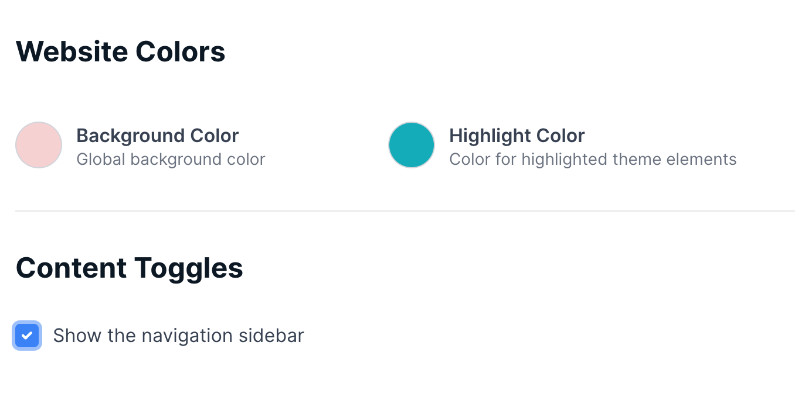

# Transistor Themes Reference

Transistor themes provide a <a href="https://shopify.github.io/liquid/">Liquid</a> template based theming system for Transistor websites. A customer can enable a website for their show, and can select one of various themes to configure in their preferred way.

## Getting Started

Theme development is done with our local theme development server, receiver. Once configured receiver will retrieve data from a Transistor show and render the contents of the theme you're building.

### Installing

Create a project folder for your theme, and download the appropriate binary for your operating system:

Mac (Intel)
```
curl https://transistorfm.s3.amazonaws.com/receiver/receiver-apple-intel -o receiver
chmod +x receiver
```
Mac (ARM)
```
curl https://transistorfm.s3.amazonaws.com/receiver/receiver-arm64 -o receiver
chmod +x receiver
```
Windows
```
curl https://transistorfm.s3.amazonaws.com/receiver/receiver-windows.exe -o receiver.exe
chmod +x receiver
```

### Running

A simple way to get started is with a basic theme skeleton generated by receiver. `./receiver new` will generate all the files necessary in a theme folder in the current directory. Once generated, you can run the development server:
```
./receiver server --api_key your_api_key --subdomain your_show_subdomain
```
And visit http://localhost:8080/

**Api Key**

Receiver uses your API key to authenticate to Transistor. Your API key can be viewed and reset in the <a href="https://dashboard.transistor.fm/account">Account Area</a> of your Transistor Dashboard.

**Subdomain**

In the website settings for your show you can chose a subdomain, this tells receiver what show it will be rendering.

**Port**

The port the receiver server runs on by default is 8080. Add a `--port 1234` to change to another port if desired.

<hr>

## Liquid

Liquid is an open-source template language created by Shopify. It uses <a href="#objects">objects</a>, <a href="#tags">tags</a>, and <a href="#filters">filters</a> to display dynamic content. Have a look at the <a href="https://shopify.github.io/liquid/">Liquid documentation</a> to get a feel for how it works.

```
<div class="episode">
  <h1>{{ episode.title }}</h1>
  
  <span>
    <time>{{ episode.published | date: '%B %d, %Y' }}</time>
    &bull;
    {{ episode.duration | divided_by: 60 | round }} minutes
  </span>
  <p class="episode-summary">{{ episode.content.notes }}</p>
</div>
```

### Includes

Liquid provides a mechanism for including a template within another template. Includes will have access to the objects provided to the top level template, but you can pass variables to them in a variety of ways:

Simply include another template:
```

```

Include a template with a local variable:
```

```

Include a template for a collection:
```

```

### Transistor Components

Transistor provides some components to use for common needs, and are used via the same <a href="#includes">include</a> mechanism above.

#### components/navigation
```


```
The navigation component generates anchor tags for the named list of links provided by the <a href="#linklist">linklist object</a>. The component will always include localized anchors for Home, Episodes, Subscribe, and People (if people have been created for the podcast). It will also include user defined pages and links between the Episodes and Subscribe links.

#### components/newsletter
```

```
The newsletter component allows users to signup for the show's newsletter, using one or more or the configured integrations for the show.

#### components/player
```

```
The player component provides a functional and styleable audio player for an episode.

#### components/search
```

```
The search component provides a submittable searchbox for episode search. Users will be routed to a paginated search results page that uses the <a href="#episodes-list--search-results-page">episodes.liquid</a> template.

#### components/social_links
```

```
The social_links component displays a list of social media links (along with email and donate links if configured). The `links` parameter is an optional list to narrow down links you'd like to display, if omitted only configured services will show.

#### components/subscribe_links
```

```
The subscribe_links component displays a list of players where listeners can subscribe to the show. The `links` parameter is an optional list to narrow down links you'd like to display, if omitted only configured players will show. An optional `limit` caps the number of links displayed.

#### components/video_embed
```

```
The video_embed component renders an embedded player for an episode's linked video (currently YouTube). It renders nothing when the episode has no `video_service`. It doesn't play Transistor hosted video, use `episode.hls_manifest_url` for that (see <a href="#episode">episode</a>).

#### components/icons
```

```
The icons component renders an inline svg for the named icon (social services, player controls, search, etc...).

#### components/person
```

```
The person component renders a <a href="#person">person</a> with their image, role, bio, and social links.

#### components/supporter, components/patreon_campaign, components/widget_supporters
```



```
Supporter components for shows with a supporters page (a Patreon integration with the supporters page turned on). Check `podcast.supporters` before using them, it's empty otherwise. `supporter` renders a single <a href="#supporter">supporter</a>, `patreon_campaign` renders the <a href="#campaign">campaign</a> with a link to support the show, and `widget_supporters` renders a small strip of supporter images linking to /supporters.

#### components/transistor
```

```
The "Broadcast by Transistor" badge. Wrap it in ``.

### Objects

The objects provided to <a href="#templates">Liquid templates</a> are consistent and relate to the url path and template. They're cataloged here, but checkout the template section below to see what you'll be provided on what url paths.

#### episode
- title - Episode title
- type - Episode type (full/trailer/bonus)
- label - "Trailer" or "Episode"
- number - Episode number
- season - Episode season
- status - Episode status
- unpublished
- published - Episode published date/time
- duration - Episode duration in seconds
- minutes - Episode duration in minutes
- summary - Episode summary
- description - Summary truncated to 200 characters, used for meta tags
- keywords - List of episode keywords
- artwork -  Image url for episode artwork
- link_url - The url link for an episode, configured by various website rules
- site_url - The full url for the episode on the show's website
- media_url - The location of the audio for this episode
- download_url - The location of the audio, served as a file download
- embed_url - The url for the embeddable Transistor player
- bluesky_url - The Bluesky post used for episode comments, if one exists
- path - A relative url path for the episode
- bytesize - Episode byte size
- has_transcript - Does the episode has a transcript available
- video_service - The service hosting the episode's linked video (i.e. youtube), if one exists
- video_id - The id of the linked video on the video_service
- video_thumbnail - Image url for the episode's video thumbnail, if one was uploaded
- hls_manifest_url - The HLS manifest (.m3u8) for an episode with Transistor hosted video. Blank for audio-only episodes. Safari plays HLS natively, other browsers need a library like <a href="https://github.com/video-dev/hls.js">hls.js</a>
- content.notes (only provided for episode.liquid) - Show notes for the episode
- content.transcript (only provided for episode.liquid) - Episode transcript, if it exists
- people (only provided for episode.liquid) - List of <a href="#person">person</a> objects for the episode

To display Bluesky comments on an episode page, include a `bluesky-comments` section and the common JavaScript will fill it in:
```

  <section id="bluesky-comments" data-bluesky-url="{{ episode.bluesky_url }}" data-bluesky-comments-enabled="{{ podcast.bluesky_comments_enabled }}"></section>

```

An episode can have a linked video (`video_id`), a hosted video (`hls_manifest_url`), both, or neither:
```

  <video controls poster="{{ episode.video_thumbnail | default: episode.artwork }}" src="{{ episode.hls_manifest_url }}"></video>

  

  

```

Example (values are illustrative). Properties without a value are `nil`, so `` works. `artwork` is `nil` when the episode has no artwork of its own, use `{{ episode.artwork | default: podcast.artwork }}`. `keywords` is an empty list when there are none.
```
{
  "title": "How We Built It",
  "type": "full",
  "label": "Episode",
  "number": 12,
  "season": 2,
  "status": "published",
  "unpublished": false,
  "published": "2026-09-01 09:00:00 -0400",
  "duration": 1834,
  "minutes": 31,
  "summary": "A look behind the scenes.",
  "description": "A look behind the scenes.",
  "keywords": ["building", "behind the scenes"],
  "artwork": "https://img.transistor.fm/.../episode.jpg",
  "link_url": "https://example.transistor.fm/episodes/how-we-built-it",
  "site_url": "https://example.transistor.fm/episodes/how-we-built-it",
  "media_url": "https://media.transistor.fm/abc123/def456.mp3?src=site",
  "download_url": "https://media.transistor.fm/abc123/def456.mp3?download=true&src=site",
  "embed_url": "https://share.transistor.fm/e/abc123",
  "bluesky_url": null,
  "path": "/episodes/how-we-built-it",
  "bytesize": 29344768,
  "has_transcript": true,
  "video_service": "youtube",
  "video_id": "dQw4w9WgXcQ",
  "video_thumbnail": null,
  "hls_manifest_url": null
}
```
`published` is a date/time, format it with the <a href="#l--localize">l</a> or `date` filters. On episode.liquid the episode also has `content` (`notes` and `transcript`, both html) and `people`.

#### page
- title - The page title, typically used in the header
- handle - The id of the page (i.e. about for about page)
- content - The content to display on the page
- description - The meta tag compatible description for the current page

#### paginate
- current_offset - The number of episodes displayed on pages prior to this one
- current_first_offset - The offset of the first episode on this page
- current_last_offset - The offset of the last episode on this page
- current_page - The current page number
- items - The total number of episodes for the show
- next.url - A url containing parameters for the next page/episode
- next.title - If there are more pages available, will contain `Next Page »` or `Next Episode »`
- next.is_link - True if there are more episode pages
- next.key - Returns the key for <a href="#localization">localizing</a> "Next Page" or "Next Episode"
- previous.url - A url containing parameters for the previous page/episode
- previous.title - If we are on page 2 or higher, will contain `« Previous Page` or `« Previous Episode`
- previous.is_link - True if we aren't on page 1
- previous.key - Returns the key for <a href="#localization">localizing</a> "Previous Page" or "Previous Episode"
- page_size - Number of episodes displayed per page
- pages - Number of total pages of episodes

#### person
- name - The name of the person
- path - The url to the person page of the website
- role - The defined role of the person (Host, Guest, Editor, etc...)
- image - The url for an image
- bio - The biography
- social_links - List of <a href="#social_link">social_link</a> objects. Including website, twitter, instagram, linkedIn, etc...
- episode_count (only provided for people.liquid) - Number of published episodes the person appears in

#### podcast
The podcast object represents the top level information for a show.
- title - Show title
- artwork - Image url for the show artwork
- description - Show description
- formatted_description - A simple formatting of the description to wrap paragraphs and insert linebreaks
- keywords - Show keywords
- feed_url - The location of the rss feed
- url - The url of the shows website
- disable_feed - Don't show a rss link
- private_feed - Is this a private show
- multiple_seasons - Does the show have multiple seasons
- episode_count - Number of published episodes
- season_count - The highest season number
- type - Episodic or Serial
- remote - True for websites built from an external rss feed, rather than a show hosted on Transistor
- noindex - Search engines shouldn't index this website
- video_enabled - True when the show publishes video episodes. Use it for contextual copy like "Watch" vs "Listen". Individual episodes may still be audio-only, so check the <a href="#episode">episode</a> before rendering a video player
- bluesky_comments_enabled - Are Bluesky comment threads enabled for episodes
- apple_smart_banner.active - Should the Apple Podcasts smart banner be displayed
- apple_smart_banner.apple_podcasts_id - The show's Apple Podcasts id
- mailinglist.active - Is a mailing list setup?
- mailinglist.headline - User configured signup headline
- mailinglist.intro - Text to be displayed below mailinglist headline
- first_episode - First episode for the show
- default_episode - The episode to feature: the first episode for serial shows, otherwise the latest
- trailer_episode - The latest trailer episode
- recommended_episode - The configured recommended episode
- recommended_shows - List of <a href="#recommended_show">recommended_show</a> objects
- supporters - The <a href="#supporter">supporters</a> and <a href="#campaign">campaign</a> for the show, if the supporters page is enabled
- email - The email address for the show
- social_links - List of <a href="#social_link">social_link</a> objects
- subscribe_links - List of subscribe_link objects (see below)
- hide_branding - If user requested to hide transistor branding
- donate.url - A donation link if configured
- donate.text - Text for donation link
- content.copyright - Copyright text
- content.footer - Configurable custom footer content
- content.head - Configurable custom content for the head tag
- custom_css - Configurable custom css
- assets.logo - Uploaded logo for site
- assets.default_favicon - Default favicon from Transistor
- assets.custom_favicon - Configured favicon for website
- assets.social_media - Uploaded social sharing image
- assets.transistor_logo - A transistor logo
- assets.common_css / assets.common_js - Styles and JavaScript for the Transistor components

#### default_episode
The <a href="#episode">episode</a> most relevant to the current page, useful for a featured player. It's the current episode on episode.liquid, the first listed episode on episodes.liquid, and `podcast.default_episode` everywhere else.

#### recommended_show
- title - Show title
- url - The url for the show
- feed_url - The location of the rss feed
- image_urls.cover / image_urls.full / image_urls.medium / image_urls.thumb - Artwork urls at various sizes

#### supporter
- name - The name of the supporter
- image - The url for an image

#### campaign
- name - The name of the campaign
- intro - Text describing the campaign
- url - Where listeners can go to support the show
- billing_period - A <a href="#localization">localization</a> key for the billing period

#### theme
- name - The name of the current theme
- preview - True when the theme is being previewed rather than being the website's configured theme

Example (values are illustrative, episode objects and assets shortened):
```
{
  "title": "Example Podcast",
  "artwork": "https://img.transistor.fm/.../show.jpg",
  "description": "A podcast about examples.",
  "formatted_description": "<p>A podcast about examples.</p>",
  "keywords": "examples, podcasting",
  "feed_url": "https://feeds.transistor.fm/example-podcast",
  "url": "https://example.transistor.fm",
  "disable_feed": false,
  "private_feed": false,
  "multiple_seasons": true,
  "episode_count": 48,
  "season_count": 2,
  "type": "episodic",
  "remote": false,
  "noindex": false,
  "video_enabled": true,
  "hide_branding": false,
  "bluesky_comments_enabled": null,
  "apple_smart_banner": { "active": true, "apple_podcasts_id": "1234567890" },
  "mailinglist": { "active": true, "headline": "Join our newsletter", "intro": null },
  "default_episode": { "title": "..." },
  "trailer_episode": null,
  "recommended_episode": null,
  "recommended_shows": null,
  "supporters": null,
  "email": "hello@example.com",
  "social_links": [{ "social": "youtube", "url": "https://youtube.com/@example", "name": "YouTube" }],
  "subscribe_links": [{ "service": "spotify", "url": "https://open.spotify.com/show/...", "name": "Spotify" }],
  "donate": { "url": null, "text": "Support this podcast!" },
  "content": { "copyright": "© 2026 Example", "footer": null, "head": null },
  "custom_css": null,
  "assets": {
    "logo": null,
    "custom_favicon": [{ "url": "https://img.transistor.fm/.../favicon.png", "sizes": "32x32" }]
  }
}
```
`podcast.keywords` is a comma separated string (empty when there are none), while `episode.keywords` is a list. Lists that would be empty (`recommended_shows`, `assets.custom_favicon`) are `nil` rather than `[]`, except `social_links` and `subscribe_links` which are always lists.

#### settings
Theme settings are configured per theme via <a href="#settings-schema">settings_schema.json</a>, described in detail below. These settings will be available to all templates.

An example might look like:
- background_color - The configured background_color or default value from settings_schema.json
- text_color - The configured text_color or default value from settings_schema.json
- show_sidebar - The configured true/false value or default from settings_schema.json

#### social_link
- social - Name of site (medium, twitter, facebook, instagram, youtube, linkedIn)
- url - Url of site
- name - Formatted name of site

#### subscribe_link
- service - Name of service (overcast, spotify, etc...)
- url - Subscribe url
- name - Formatted name of service

#### link
- title - The display text for the link
- url - The url or path representing the location for the link
- current - A true/false value to indicate if the user is currently on this page, useful for css treatment
- external - True when the link points to an external url
- handle - The id of the linked page (i.e. episodes, subscribe, about)

#### linklist
- header - Contains a list of header <a href="#link">links</a> that represent external urls and pages
- footer - Contains a list of footer <a href="#link">links</a> that represent external urls and pages

### Tags

#### icon
```

```
Renders one of Transistor's svg icons inline.

### Filters

Transistor adds several filters to the <a href="https://shopify.github.io/liquid/">filters provided by Liquid</a>.

#### asset_url
Used to serve assets from the theme's asset directory. These can be images, svgs, css, or js files. If a css file has a liquid extension (i.e. theme.css.liquid) if will be provided the podcast and settings objects for dynamic evaluation.

#### brighten / darken
Lightens or darkens a html color code by the provided amount.
```
{{ settings.background_color | darken: 10 }}
```

#### brightness
Provided a html color code, returns the brightness as an integer value between 0 and 255.

#### encoded_mailto
Encodes the provided email, prepending a `mailto:` in a way that makes it more difficult for crawlers to find.

#### greatest_contrast
Provided a base color, and a list of secondary colors, it will return the color with the greatest contrast to the base. Used to provide text/overlay colors with enough contrast.
example usage:
```
<style>
  --color-text: {{ settings.background_color | greatest_contrast: "#FFFFFF", "#131E36" }}
</style>
```

#### force_contrast
Adjusts the brightness of the provided color until it meets the WCAG AA contrast ratio (4.5) against the base color.
```
{{ settings.background_color | force_contrast: settings.text_color }}
```

#### hhmmss
Formats the duration in seconds for display in hh:mm:ss format, skipping hours if the duration is shorter than one hour.

#### l / localize
Formats a date for the website's language. Accepts an optional format, defaulting to `month_day_year`.
```
{{ episode.published | l }}
```

#### number_to_human_size
Formats the number of bytes into a more understandable representation. e.g. 1500 will result in 1.5 KB.

#### t / translate
Returns the <a href="#localization">localized</a> text for a key, in the website's language. Values can be interpolated.
```
{{ 'player.play' | t }}
{{ paginate.next.key | t }}
```

#### to_rgb
Converts a html color code to space separated rgb values, e.g. #FFFFFF will result in `255 255 255`. Useful for css like `rgb(var(--color-text) / 0.5)`.

### Localization
Websites can be configured with a language. Transistor provides translations for common website text (navigation, player controls, pagination, people roles, etc...) via the <a href="#t--translate">t</a> filter, and dates via the <a href="#l--localize">l</a> filter. Objects with a `key` property (like `paginate.next.key`) or that return a key (like `person.role` and `campaign.billing_period`) are meant to be passed through `t`.

Only the keys below exist, shown with their English text. A key that isn't listed renders "Translation missing", so don't invent keys. Text your theme needs that isn't covered here has to be written into the theme, and won't be translated. `%{name}` values are interpolated: `{{ 'share.listen_to' | t: title: podcast.title, name: link.name }}`.

<!-- translation-keys:start -->
```
locale                               en
lang_dir                             ltr
navigation.home                      Home
navigation.about                     About
navigation.episodes                  Episodes
navigation.people                    People
navigation.recommended_shows         Recommended Shows
navigation.subscribe                 Subscribe
navigation.supporters                Supporters
navigation.shows                     Shows
mailinglist.headline                 Join our newsletter
mailinglist.input                    Your email address
mailinglist.submit                   Subscribe
mailinglist.confirmation             Got it. You're on the list!
episode.one                          Episode
episode.other                        Episodes
episode.first                        First Episode
episode.latest                       Latest Episode
episode.first_episodes               First Episodes
episode.latest_episodes              Latest Episodes
episode.recommended                  Recommended Episode
episode.next                         Next Episode
episode.previous                     Previous Episode
episode.coming_soon                  Episodes are coming soon.
episode.more                         More Episodes
episode.all                          All Episodes
episode.show_notes                   Show Notes
episode.view_show_notes              View episode details
episode.details                      Episode Details
episode.transcript                   Transcript
episode.view_transcript              View episode transcript
episode.season                       Season
episode.video                        Episode Video
episode.episode_of                   Episode %{number} of
episode.search_placeholder           Search episodes...
people.headline                      Creators and Guests
people.appears_in                    Appears in
people.roles.guest                   Guest
people.roles.host                    Host
people.roles.hosts                   Hosts
people.roles.editor                  Editor
people.roles.writer                  Writer
people.roles.designer                Designer
people.roles.composer                Composer
people.roles.producer                Producer
recommended_shows.headline           Recommended Shows
supporters.headline                  Supporters of the Podcast
supporters.one                       Supporter
supporters.other                     Supporters
supporters.support_on                Support on
supporters.goal_progress             %{percent}% of $%{total}
supporters.month                     per month
supporters.creation                  per creation
supporters.join                      Join %{total} supporters
shows.headline                       Shows
shows.search_placeholder             Search shows...
shows.all                            All Shows
shows.view_website                   View Website
play.episode_one                     Play Episode One
play.trailer                         Play Trailer
play.episode                         Play Episode
pause.episode                        Pause Episode
listen.trailer                       Listen to the Trailer
units.minutes                        Minutes
misc.download                        Download
misc.donate_text                     Support this podcast!
misc.introduction                    Introduction
transistor.broadcast_by              Broadcast by
transistor.free_broadcast_by         Free Podcast Website provided by
pagination.info                      Displaying <b>%{first}&nbsp;-&nbsp;%{last}</b> of <b>%{total}</b> in total
pagination.next                      Next
pagination.previous                  Previous
pagination.next_page                 Next Page
pagination.prev_page                 Previous Page
share.headline                       Listen to <strong>%{title}</strong> using one of many popular podcasting apps or directories.
share.what_is                        What is %{title}?
share.view_on                        View %{title} on %{name}
share.listen_to                      Listen to %{title} on %{name}
share.listen_on                      Listen On
share.follow                         Follow
share.follow_on                      Follow On %{name}
share.listen_anywhere                Listen Anywhere
share.email_us                       Email Us
share.subscribe_rss                  Subscribe by RSS Feed
share.subscribe                      Subscribe
share.subscribe_and_listen           Subscribe and Listen
share.rss_feed                       RSS Feed
share.rss_feed_url                   RSS Feed URL
share.more_options                   More Options
share.copy_url                       Copy URL
share.copied                         Copied!
share.watch                          Watch
share.listen                         Listen
share.content_attribution_notice     All audio, artwork, episode descriptions and notes are property of %{author}, for %{title}, and published with permission by Transistor, Inc.
player.play                          Play
player.pause                         Pause
player.rewind                        Rewind 10 seconds
player.forward                       Fast Forward 30 seconds
player.forward_dynamic               Fast Forward ${selectedEpisode?.duration > 40 ? 30 : 10} seconds
player.seek                          Seek within Episode
player.mute                          Mute
player.unmute                        Unmute
player.speed                         Change Playback Speed
player.speed_label                   Change Playback Speed (currently ${displaySpeed} times speed)
player.minimize                      Minimize Player
player.adjust_volume                 Adjust volume
comments.headline                    Comments and Discussion
comments.loading                     Loading comments&hellip;
comments.view_and_reply              View post and reply on Bluesky
comments.likes                       likes
comments.reposts                     reposts
comments.replies                     replies
comments.join_discussion             Reply on Bluesky <a :href="postUrl" :title="t('comments.view_and_reply')" target="_bsky">here</a> to join the discussion.
comments.no_comments                 No comments yet. Be the first by <a :href="postUrl" :title="t('comments.view_and_reply')" target="_bsky" class="episode-comments-reply-link">replying on Bluesky</a>!
comments.error_loading               There was a problem loading the comments. Please try again soon.
search.headline                      Search Results
search.placeholder                   Search episodes...
search.no_results                    No results found for <strong>'%{search_query}'</strong>&hellip;
```
<!-- translation-keys:end -->


## Templates

Transistor websites are comprised of the following templates. Each template is rendered at paths listed below and provided the appropriate liquid objects to render.

Objects: All pages will have access to the `podcast`, `settings`, `page`, `linklists`, `default_episode`, and `theme` objects.

#### Layout
template: layout/theme.liquid

The theme layout is a special template that provides the main wrapper for all other pages in the website. Displaying `content_for_header` and `content_for_layout` objects is required. The header will be used to inject necessary header content (meta tags, favicons, configured analytics providers, and component JavaScript). The layout will accept the rendered content from the current page.

Example:
```
<html>
  <head>
    <title>{{ page.title }}</title>
    {{ content_for_header }}
    <link rel="stylesheet" media="all" href="{{ 'theme.css' | asset_url }}" type="text/css">
  </head>
  <body class="{{ page.handle }}">
    <a class="home" title="Home" href="/">Home</a>
    <h1>{{ podcast.title }}</h1>
    <section>
      {{ content_for_layout }}
    </section>
  </body>
</html>
```

#### Homepage
template: index.liquid
<br/>path: /
<br/>objects: episodes, paginate

#### Episodes List / Search Results Page
template: episodes.liquid
<br/>path: /episodes and /search
<br/>objects: episodes, paginate, search_query (search only)

#### Episode Page
template: episode.liquid
<br/>route: episodes/episode-slug
<br/>objects: episode, paginate

#### Page
template: page.liquid
<br/>route: /page-handle
<br/>*No objects beyond page, podcast, and settings*

#### Subscribe
template: subscribe.liquid
<br/>route: /subscribe
<br/>*No objects beyond page, podcast, and settings*

#### People
template: people.liquid
<br/>route: /people
<br/>objects: people

#### Person
template: person.liquid
<br/>route: people/person-slug
<br/>objects: person, episodes, paginate

#### Supporters
template: supporters.liquid
<br/>route: /supporters
<br/>objects: supporters, campaign

Only available when the show has a supporters page enabled.

#### Recommended Shows
template: recommended_shows.liquid
<br/>route: /recommended
<br/>objects: recommended_shows

Only available when the theme declares the `podroll` feature in <a href="#settings-schema">settings_schema.json</a>.

### Assets
Assets will be placed in the /asset folder in your theme. It's recommended that you package up a single css, and js file if needed. Reference them by using the <a href="#filters">asset_url</a> filter which will provide the url to the file.
```
<link rel="stylesheet" media="all" href="{{ 'theme.css' | asset_url }}"
```
It is recommended to use <a href="https://developer.mozilla.org/en-US/docs/Web/CSS/Using_CSS_custom_properties">CSS variables</a> in your layout's head tag to provide theme settings to the rest of the css. <a href="#settings-schema">Read more about settings below.</a>

### Settings Schema
The config/settings_schema.json file allows for user configurable settings. Each settings group will be presented in the website configuration, titled with the group's name.

Types include:
* `color` - Presents a colorpicker for and represents an HTML color code (#FFFFFF)
* `text` - Presents a text input, and evaluates to the entered text
* `checkbox` - Presents a checkbox, and evaluates to a boolean value in a template allowing usage like `content`

The `label` and `info` are used to describe the setting in the website configuration. The `default` value will represent the value prior to user configuration.

A `theme_info` group describes the theme itself, and declares optional `features` the theme supports. Declare `podroll` if your theme includes a recommended_shows.liquid template.
```
{
  "name": "theme_info",
  "theme_name": "My Theme",
  "theme_author": "Me",
  "theme_version": "1.0.0",
  "features": ["podroll"],
  "color_roles": {
    "background": "background_color",
    "text": "text_color",
    "primary_button": ["highlight_color", "link_color"],
    "on_primary_button": "player_color"
  }
}
```

#### Color roles
`color_roles` in `theme_info` tags color settings with a role: `background`, `text`, `primary_button` (links, buttons, the player) or `on_primary_button` (text on those). Each role takes an id or a list of ids. Roles only affect the website configuration: they pick the three colors shown in each <a href="#settings-data">preset</a> swatch.

Note: `receiver` will use default values from settings_schema.json for local development. Set them to your desired defaults when completing the theme.
```
[
  {
    "name": "Website Colors",
    "settings": [
      {
        "type": "color",
        "id": "background_color",
        "label": "Background Color",
        "default": "#FFFFFF",
        "info": "Global background color"
      },
      {
        "type": "color",
        "id": "highlight_color",
        "label": "Highlight Color",
        "default": "#FFFFFF",
        "info": "Color for highlighted theme elements"
      },
    ]
  },
  {
    "name": "Content Toggles",
    "settings": [
      {
        "type": "checkbox",
        "id": "show_nav_sidebar",
        "label": "Show the navigation sidebar",
        "default": true
      }
    ]
  }
]
```


### Settings Data
`config/settings_data.json` ships named color presets. Each preset maps `color` setting ids to values; any subset of the theme's colors works, and other ids are ignored.
```
{
  "presets": {
    "Paper": {
      "background_color": "#FFFFFF",
      "text_color": "#1E293B",
      "link_color": "#0369A1"
    },
    "Midnight": {
      "background_color": "#0F172A",
      "text_color": "#F8FAFC",
      "link_color": "#FBBF24"
    }
  }
}
```
Presets show up as a row of swatches in the website configuration, named on hover. Picking one fills the matching color pickers as a starting point; the owner can adjust and save from there. The choice itself isn't stored, so presets can be renamed or removed freely.

For settings used in css, place <a href="https://developer.mozilla.org/en-US/docs/Web/CSS/Using_CSS_custom_properties">css variables</a> in a `<style>` tag within the `<head>` of your <a href="#layout">layout/theme.liquid</a>. These will then be accessible in included css files.

layout/theme.liquid
```
<head>
  <title>{{ page.title }}</title>
  {{ content_for_header }}
  <style>
    :root {
      --color-background: {{ settings.background_color }};
      --color-highlight: {{ settings.highlight_color }};
    }
  </style>
  <link rel="stylesheet" media="all" href="{{ 'theme.css' | asset_url }}" type="text/css">
</head>
...
```

assets/theme.css
```
body {
  background-color: var(--color-background);
}
```
